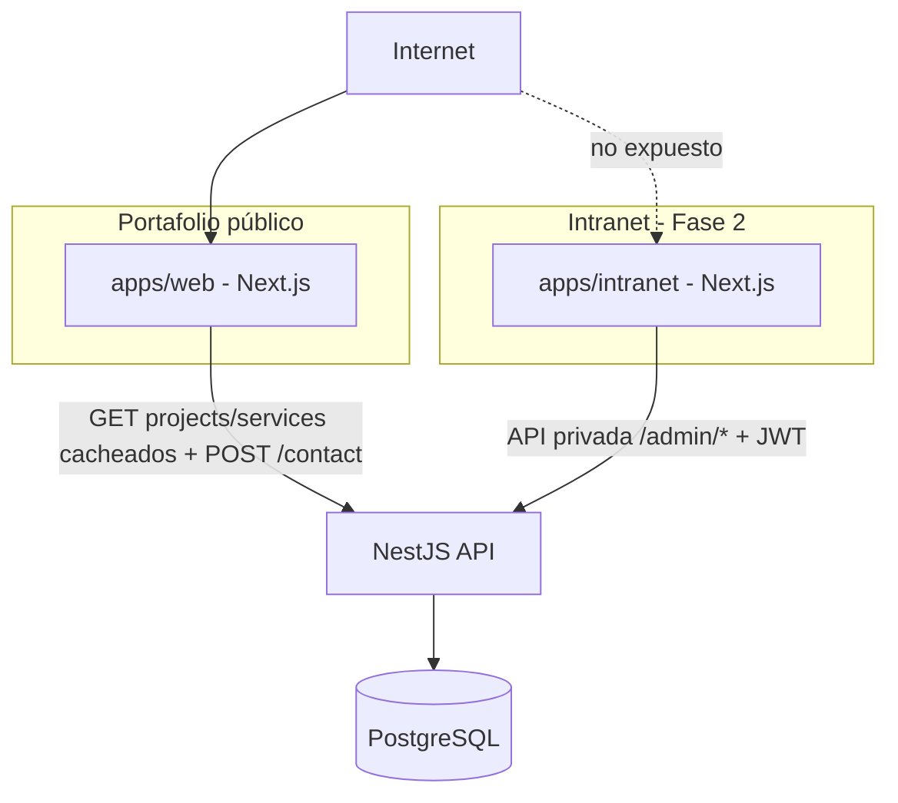
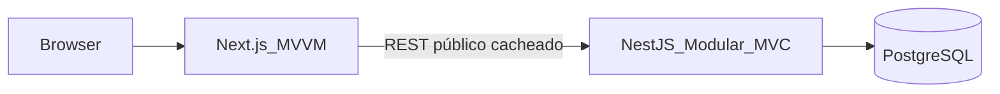
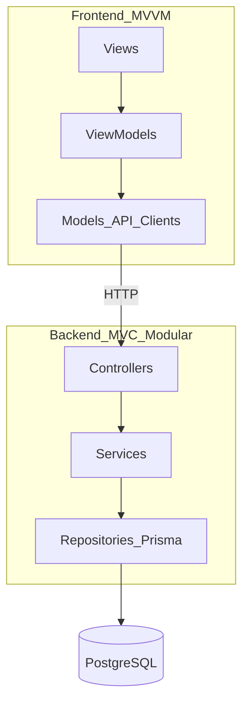
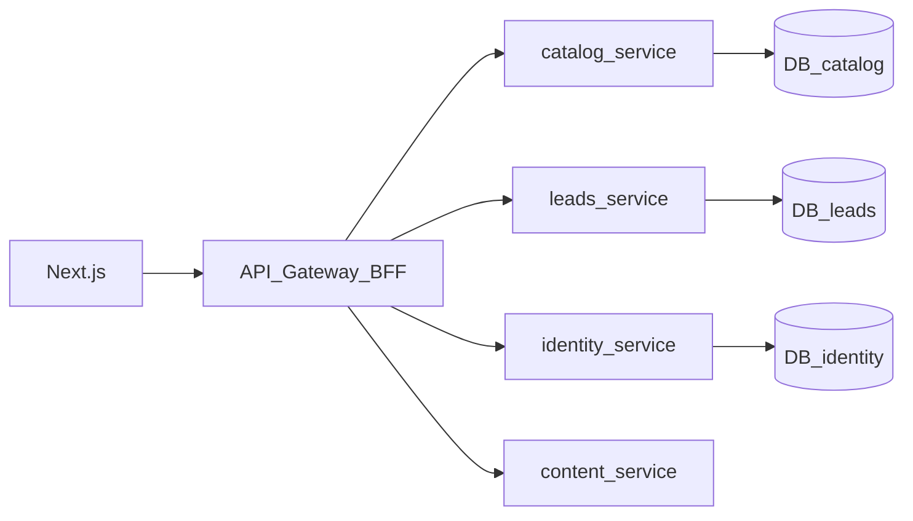

# Plan de desarrollo — Landing personal → Consultoría de software

## 1. Visión del producto

Construir una plataforma web fullstack en JavaScript/TypeScript que empiece como **marca personal** (ingeniero de sistemas, desarrollador web, análisis de datos) y evolucione de forma controlada hacia una **consultoría de desarrollo de páginas web y software**.

Principios:

- Aprender paso a paso (cada fase entrega algo usable).
- Arquitectura clara desde el día 1, sin sobre-ingeniería prematura.
- **Monolito modular primero**, **microservicios después** cuando haya dominio y carga reales.
- Escalable en código, datos, despliegue y modelo de negocio.

---

## 2. Identidad y evolución de marca

| Etapa | Identidad | Enfoque |
|-------|-----------|---------|
| Fase 1–2 | Marca personal | Portfolio, servicios individuales, contacto, proyectos |
| Fase 3–4 | Puente personal → consultoría | Casos, leads, “Agendar consultoría”, servicios empaquetados |
| Fase 5+ | Consultoría | Marca comercial, multi-servicio, CRM ligero, cotizaciones |

El dominio de datos y las APIs se diseñan con entidades genéricas (`Project`, `Service`, `Lead`, `CaseStudy`) para no reescribir el backend al cambiar de marca personal a consultoría.

---

## 3. Objetivos de aprendizaje

Al terminar las primeras fases habrás practicado:

- TypeScript estricto en frontend y backend
- React + Next.js (App Router) con patrón **MVVM**
- NestJS con módulos (**MVC modular**)
- PostgreSQL + migraciones
- Autenticación, validación, APIs REST
- Despliegue (frontend en Vercel; API y DB en plataforma compatible)
- Evolución a microservicios cuando el monolito modular lo justifique

---

## 4. Stack tecnológico

### Frontend

| Tecnología | Uso |
|------------|-----|
| TypeScript | Tipado estricto |
| React 19 | UI basada en componentes |
| Next.js (App Router) | SSR/SSG, routing, SEO |
| Tailwind CSS | Estilos utilitarios |
| React Hook Form + Zod | Formularios y validación |
| TanStack Query (opcional fase 2) | Caché/estado servidor |

**Arquitectura frontend: Componentes + MVVM**

```
View (UI)          → Componentes React (solo presentación y eventos)
ViewModel          → Hooks / clases livianas: estado, comandos, binding a la View
Model              → Tipos de dominio + clientes HTTP hacia la API
```

Ejemplo de carpetas:

```
apps/web/          # Portafolio público (visitantes)
  src/
    app/                 # Rutas Next.js (pages/layouts)
    views/               # Views (páginas/secciones UI)
    viewmodels/          # Hooks ViewModel (useContactFormVM, useSiteHeaderVM)
    models/              # Tipos + API clients (solo superficie pública)
    components/          # UI reutilizable (botones, layout)
    shared/              # utilidades, constants

apps/intranet/     # CMS/CRM interno (Fase 2 — ver README en esa carpeta)
apps/api/          # NestJS — rutas públicas + /admin/* privadas
```

Reglas MVVM en este proyecto:

1. Las Views no llaman a `fetch` directamente.
2. Los ViewModels exponen estado (`isLoading`, `error`, `data`) y comandos (`submit`, `load`).
3. Los Models encapsulan contratos con NestJS (DTOs alineados con el backend).
4. **Portafolio público:** catálogo en Server Components con cache; en cliente solo mutaciones (`POST /contact`). Sin `useEffect(() => fetch(...))` para listados.
5. **Intranet (Fase 2):** fetch autenticado solo en `apps/intranet`, nunca en `apps/web`.

### Backend

| Tecnología | Uso |
|------------|-----|
| TypeScript | Tipado estricto |
| NestJS | API modular, DI, validación |
| Prisma (u TypeORM) | ORM + migraciones PostgreSQL |
| PostgreSQL | Base de datos relacional |
| Passport/JWT | Auth admin (fase 2) |
| class-validator / Zod | Validación de DTOs |
| Swagger/OpenAPI | Documentación de API |

**Arquitectura backend: MVC modular → microservicios**

En NestJS el mapeo MVC es:

| Capa MVC | NestJS |
|----------|--------|
| Model | Entidades Prisma + repositorios/servicios de dominio |
| View | Respuestas JSON / DTOs de salida (no HTML) |
| Controller | Controllers HTTP (entrada/salida) |

Estructura modular (monolito modular):

```
apps/api/
  src/
    main.ts
    app.module.ts
    modules/
      health/
      contact/          # leads / mensajes
      projects/
      services/         # servicios ofrecidos
      auth/             # fase 2 (solo intranet)
      admin/            # fase 2 — /api/v1/admin/*
    common/             # filters, guards, pipes, interceptors
    config/
```

**Microservicios (fase avanzada, no día 1):**

Cuando el monolito modular esté estable, se extraen servicios por dominio:

| Microservicio | Responsabilidad |
|---------------|-----------------|
| `gateway` / `api-bff` | Entrada única, auth, enrutado |
| `catalog-service` | Proyectos, servicios, casos |
| `leads-service` | Contacto, CRM ligero |
| `identity-service` | Usuarios admin, JWT |
| `content-service` | Blog / artículos (si aplica) |

Comunicación: HTTP/REST o mensajería (Redis/NATS) según necesidad. El frontend sigue hablando con un **único BFF/gateway**.

### Datos y hosting

| Componente | Tecnología sugerida |
|------------|---------------------|
| DB | PostgreSQL (Neon, Supabase o Railway) |
| Frontend host | Vercel |
| Backend host | Railway / Render / Fly.io (NestJS no es ideal como app larga en Vercel Functions) |
| Monorepo | pnpm + Turborepo (o npm workspaces) |

### Herramientas de desarrollo

- ESLint + Prettier
- Husky (opcional) + lint-staged
- Docker Compose local (API + PostgreSQL)
- Git + GitHub

---

## 5. Requisitos funcionales (RF)

### RF — Marca personal (MVP y crecimiento)

| ID | Requisito | Prioridad | Fase |
|----|-----------|-----------|------|
| RF-01 | Página de inicio con hero de marca personal, headline y CTA | Alta | 1 |
| RF-02 | Sección “Sobre mí” (experiencia, stack, enfoque) | Alta | 1 |
| RF-03 | Listado de proyectos/portfolio (título, tech, link, imagen) | Alta | 1 |
| RF-04 | Sección de servicios individuales (web, fullstack, datos) | Alta | 1 |
| RF-05 | Formulario de contacto (nombre, email, mensaje) persistido en PostgreSQL | Alta | 1 |
| RF-06 | Página de detalle de proyecto | Media | 1–2 |
| RF-07 | SEO básico (metadata, Open Graph, sitemap) | Alta | 1 |
| RF-08 | Diseño responsive (móvil y desktop) | Alta | 1 |
| RF-09 | Login de administrador | Alta | 2 |
| RF-10 | CRUD de proyectos desde panel admin | Alta | 2 |
| RF-11 | CRUD de servicios desde panel admin | Media | 2 |
| RF-12 | Bandeja de mensajes/leads (leer, marcar atendido) | Alta | 2 |
| RF-13 | Blog o casos de estudio gestionables | Media | 3 |
| RF-14 | CTA “Agendar consultoría” / captura de lead calificado | Alta | 3 |
| RF-15 | Catálogo de paquetes de consultoría (Landing, Web App, Software a medida) | Media | 3 |
| RF-16 | Multi-idioma (ES / EN) | Baja | 4+ |
| RF-17 | Cotizaciones / pipeline simple de oportunidades | Media | 4–5 |
| RF-18 | Área cliente (estado de proyectos) | Baja | 5+ |

### RF — Sistema / plataforma

| ID | Requisito | Prioridad | Fase |
|----|-----------|-----------|------|
| RF-S1 | API REST versionada (`/api/v1/...`) | Alta | 1 |
| RF-S2 | Healthcheck del backend | Alta | 1 |
| RF-S3 | Migraciones de base de datos versionadas | Alta | 1 |
| RF-S4 | Documentación OpenAPI/Swagger | Media | 1–2 |
| RF-S5 | Roles (al menos `admin`) | Alta | 2 |
| RF-S6 | Separación por módulos Nest listos para extraer a microservicios | Alta | 2–4 |

---

## 6. Requisitos no funcionales (RNF)

| ID | Categoría | Requisito |
|----|-----------|-----------|
| RNF-01 | Rendimiento | LCP de landing < 2.5s en condiciones normales (Next.js SSG/ISR donde aplique) |
| RNF-02 | Disponibilidad | Frontend y API con healthchecks; objetivo 99% en hosting free/paid inicial |
| RNF-03 | Seguridad | HTTPS; validación de inputs; rate limit en contacto; secretos en env; JWT seguro |
| RNF-04 | Escalabilidad | Monolito modular con boundaries claros; extracción a microservicios sin reescribir el frontend |
| RNF-05 | Mantenibilidad | TypeScript strict; lint; módulos por dominio; convenciones MVVM/MVC |
| RNF-06 | Observabilidad | Logs estructurados; errores centralizados; métricas básicas en fase 3+ |
| RNF-07 | Usabilidad | Accesibilidad AA básica; contraste; formularios con feedback claro |
| RNF-08 | Portabilidad | Docker Compose local; variables de entorno documentadas |
| RNF-09 | SEO | Rutas indexables; metadata por página |
| RNF-10 | Costo | Stack compatible con planes free/low-cost al inicio (Vercel + Neon/Railway) |

---

## 7. Arquitectura del sistema

### Vista lógica — portafolio público vs intranet (decisión adoptada)

El visitante **no** comparte flujo con el CRM. Dos frontends, una API, una DB:



**Reglas:**

1. **Contenido público** — estático o cacheado en `apps/web` (ISR/`unstable_cache`). El visitante no dispara lecturas constantes a PostgreSQL.
2. **Operaciones dinámicas públicas** — solo `POST /contact` (lead).
3. **Intranet** — app separada `apps/intranet`; CRUD, auth y bandeja de leads. Sin rutas admin en `apps/web`.
4. **Revalidación** — al publicar desde intranet, invalidar cache del portafolio (webhook / `revalidateTag`).

### Vista lógica (fases 1–3: monolito modular) — capa API



### Vista de capas



### Evolución a microservicios (fase 4+)



Regla de oro: **no dividir en microservicios hasta** tener al menos admin + leads + catálogo estables y una razón concreta (equipo, despliegue independiente o carga).

---

## 8. Modelo de datos inicial (PostgreSQL)

Entidades mínimas:

- `User` — admin (fase 2)
- `Project` — portfolio
- `Service` — servicios ofrecidos
- `Lead` / `ContactMessage` — formularios
- `CaseStudy` / `Post` — fase 3
- `ConsultingPackage` — fase 3

Relaciones principales:

- `User` 1—N `Project` (autor/admin)
- `Lead` independiente (origen: contacto / consultoría)
- `Service` y `ConsultingPackage` alimentan la landing pública

---

## 9. Estructura del monorepo

```
ProyectoFullStack_JS/
  apps/
    web/                 # Next.js (MVVM)
    api/                 # NestJS (MVC modular)
  packages/
    shared/              # Tipos/DTOs compartidos (opcional pronto)
    tsconfig/            # configs TS compartidas
  docs/
    PLAN_DESARROLLO.md   # este documento
  docker-compose.yml     # PostgreSQL (+ api en local)
  package.json           # workspaces
  README.md
```

---

## 10. Roadmap por fases (aprendizaje paso a paso)

### Fase 0 — Fundación (1 sesión)

- Inicializar monorepo (pnpm workspaces o Turborepo)
- `apps/web` Next.js + TypeScript + Tailwind
- `apps/api` NestJS + TypeScript
- PostgreSQL con Docker Compose
- Variables de entorno ejemplo (`.env.example`)
- README con cómo levantar el proyecto

**Entregable:** ambos apps corren en local; `/health` responde OK.

### Fase 1 — Landing personal + contacto (MVP público)

- UI marca personal (hero, sobre mí, servicios estáticos o desde API, proyectos)
- MVVM: `useContactFormVM`, `useProjectsVM`
- API: módulos `projects`, `services`, `contact`
- Persistencia de leads en PostgreSQL
- Rate limiting básico en contacto
- Deploy: web → Vercel; API → Railway/Render; DB → Neon/Railway

**Entregable:** sitio público con formulario que guarda en DB.

### Fase 2 — Intranet / CMS (app separada)

- Nueva app **`apps/intranet`** (Next.js + MVVM), **no** rutas admin dentro de `apps/web`
- Auth JWT (`auth` module) + prefijo **`/api/v1/admin/*`**
- CRUD proyectos / servicios / leads solo desde intranet
- Guards y roles en Nest; endpoints admin nunca públicos
- Al publicar: revalidar cache ISR del portafolio (`revalidateTag('landing')`)

**Entregable:** gestionas contenido y leads en intranet; el visitante solo ve landing cacheada + formulario de contacto.

### Fase 2 (descartado)

~~Panel admin (Next.js rutas protegidas en la misma app web)~~ — mezcla flujo público con CRM y multiplica peticiones/ superficie de ataque.

### Fase 3 — Puente a consultoría

- Casos de estudio / blog
- Paquetes de consultoría
- Lead calificado (“Agendar consultoría”)
- Ajustes de copy/branding (personal + consultoría)

**Entregable:** la misma plataforma vende servicios de consultoría.

### Fase 4 — Hardening y preparación microservicios

- Observabilidad, tests e2e críticos
- Boundaries más estrictos por módulo
- Shared contracts en `packages/shared`
- Decisión documentada de qué módulo extraer primero (suele ser `leads` o `identity`)

### Fase 5 — Microservicios + consultoría operativa

- Extraer 1–2 microservicios reales
- Gateway/BFF
- Pipeline de oportunidades / cotizaciones (si el negocio lo pide)

---

## 11. Criterios de escalabilidad hacia consultoría

Para que esto escale como consultoría tecnológica, el diseño debe permitir:

1. **Contenido dinámico** — servicios, casos y precios sin redeploy de lógica.
2. **Captura y gestión de leads** — de formulario a CRM ligero.
3. **Separación de dominios** — catálogo vs leads vs identidad.
4. **Misma API pública** — el frontend no se rompe al extraer microservicios.
5. **Multi-oferta** — web, software a medida, datos/analytics como líneas de servicio.
6. **Marca flexible** — config de branding (nombre, logo, CTAs) sin hardcode excesivo.

---

## 12. Decisiones técnicas adoptadas

| Decisión | Elección | Motivo |
|----------|----------|--------|
| Identidad inicial | Marca personal | Construye credibilidad; evoluciona a consultoría |
| Frontend pattern | Componentes + MVVM | Separación View/ViewModel/Model clara para aprendizaje |
| Backend inicial | NestJS monolito modular MVC | Aprender MVC limpio sin caos de microservicios prematuros |
| Microservicios | Fase 4–5 | Escalabilidad real cuando haya dominio estable |
| DB | PostgreSQL + Prisma | Estándar fullstack, migraciones sólidas |
| Deploy | Vercel (web) + Railway/Render (api) + Neon/Railway (DB) | NestJS necesita runtime Node continuo |
| MVP fase 1 | Landing + contacto en DB | Valor público rápido; base para intranet en fase 2 |
| Portafolio vs intranet | Apps separadas (`web` + `intranet`) | Visitante no consulta CRM ni DB completa; menos peticiones y menor riesgo |
| Datos en landing | Server cache (ISR) + solo POST contacto en cliente | Evita `useEffect(fetch)` innecesarios en el flujo público |

---

## 13. Fuera de alcance (por ahora)

- App móvil nativa
- Pagos / facturación electrónica
- Chat en tiempo real
- Multi-tenant completo (varias empresas cliente en un solo deploy)
- Microservicios en el día 1

---

## 14. Definición de “listo” por fase

**Fase 1 lista cuando:**

- Landing responsive publicada
- Proyectos visibles
- Formulario guarda leads en PostgreSQL
- README permite clonar y correr en local

**Fase 2 lista cuando:**

- Intranet (`apps/intranet`) desplegada en URL privada (VPN, subdominio restringido o auth)
- Admin puede autenticarse contra `/api/v1/admin/*`
- CRUD de proyectos y revisión de mensajes funcionan en producción
- Publicar contenido revalida el cache del portafolio público

**Fase 3 lista cuando:**

- Existe al menos un flujo claro de “quiero una consultoría / cotización”
- Contenido de casos o paquetes gestionable

---

## 15. Próximo paso inmediato

Al aprobar este plan, la **Fase 0** consiste en:

1. Crear monorepo + `apps/web` + `apps/api`
2. Conectar PostgreSQL local
3. Endpoint `GET /api/v1/health`
4. Landing esqueleto en Next.js con estructura MVVM vacía
5. Documentar comandos `dev`, `build`, `start`

Cuando confirmes, empezamos la Fase 0 en el código.
